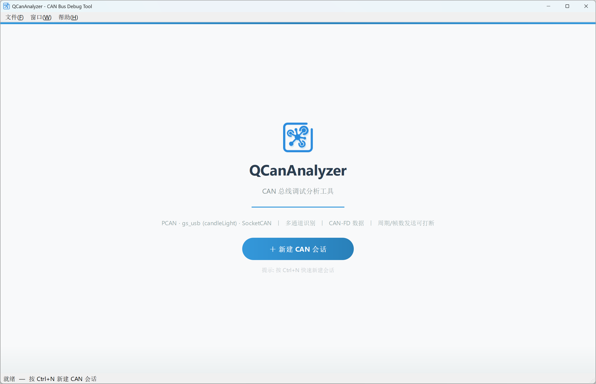
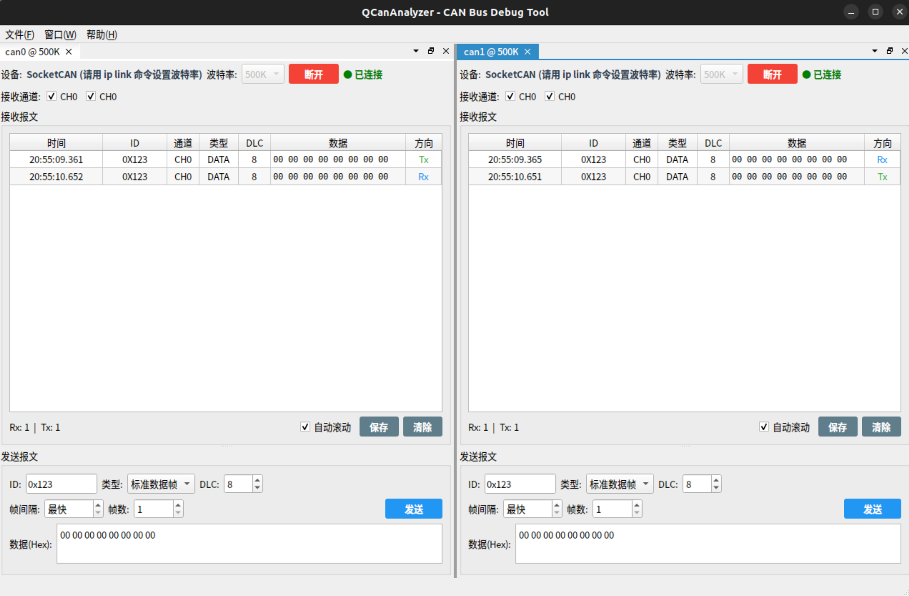
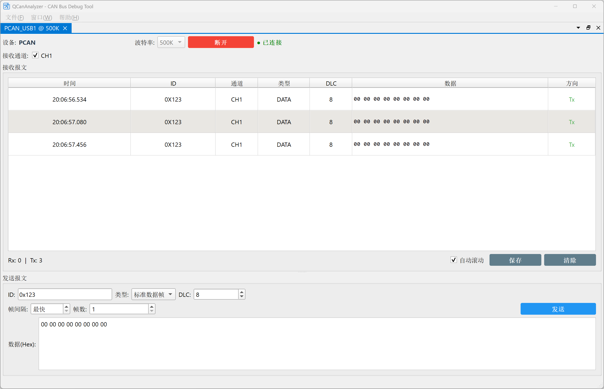

# QCanAnalyzer — CAN 总线调试分析工具

> ⚠️ **AI 声明**: 本项目 100% 由 GitHub Copilot (DeepSeek V4 Pro) 在 VS Code 中生成，包括但不限于：工程结构设计、PCAN/gs_usb/ZCANFD/ZCAN/SocketCAN/MockCAN 多适配器架构、Qt Advanced Docking System 集成、所有 UI 布局与样式、CAN 报文收发逻辑。人工仅负责提出需求和编译验证。

---

## 功能特性

- 🔌 **多设备支持** — PCAN (PEAK USB/PCI)、gs_usb (candleLight)、ZCANFD/ZCAN (ZLG USBCANFD)、SocketCAN (Linux)、MockCAN (虚拟)
- 🐧 **跨平台** — Windows + Linux，Linux 下原生支持 SocketCAN，自动隐藏不可用适配器
- 🪟 **多会话停靠** — 基于 Qt Advanced Docking System，同时开启多个 CAN 会话，标签页分组
- 📡 **CAN-FD 支持** — DLC 0~64，数据输入框支持 64 字节十六进制数据
- 📥 **灵活发送** — 标准帧/扩展帧/远程帧；周期发送（锁定周期防误触）；指定帧数批量发送；发送中可随时打断
- 🔢 **十六进制输入** — 数据输入自动过滤非法字符，仅保留 0-9、A-F、空格
- 🔍 **软过滤器** — ID 掩码过滤 + 通道使能复选框，可灵活筛选关注的报文
- 📊 **通道识别** — 报文列表显示通道列，多通道设备可区分来源
- 💾 **CSV 导出** — 一键保存所有收发帧为 CSV（含通道信息）
- 🔗 **断线检测** — 500ms 间隔监控设备连接，gs_usb 支持自动通道恢复；ZCANFD 防重复打开保护
- 🎨 **高 DPI 适配** — 175% 缩放正常
- 🧪 **MockCAN 虚拟适配器** — Debug 模式下自动可用，无需硬件即可测试和演示

## 支持的设备

| 适配器 | 平台 | 说明 |
|--------|------|------|
| **PCAN** | Windows | PEAK-System 全系列，需 PCANBasic.dll |
| **gs_usb** | Windows / Linux | candleLight 等开源 CAN 适配器 |
| **ZCANFD** | Windows / Linux | ZLG USBCANFD 系列 (CAN FD)，需 ControlCANFD.dll |
| **ZCAN** | Windows | ZLG USBCAN 系列 (仅标准 CAN)，需 ControlCAN.dll |
| **SocketCAN** | Linux | 内核原生 CAN 子系统 (can0, vcan0...) |
| **MockCAN** | 跨平台 | 虚拟适配器，仅 Debug 模式可用，用于无硬件测试 |

### Linux 下 SocketCAN 使用注意

SocketCAN **不支持软件设置波特率**，请在连接前用 `ip` 命令配置：

```bash
sudo ip link set can0 type can bitrate 500000
sudo ip link set up can0
# 虚拟 CAN 用于测试:
sudo modprobe vcan
sudo ip link add dev vcan0 type vcan
sudo ip link set up vcan0
```

## 截图

### 欢迎页



### CAN 会话



### 数据发送



## 构建

### 环境要求

- **Qt 5.14+** (推荐 MinGW 64-bit / GCC)
- **Windows** 或 **Linux**
- Git + Git LFS

### 步骤

```bash
# 1. 克隆 ADS 库
cd libs
git clone https://github.com/githubuser0xFFFF/Qt-Advanced-Docking-System.git
# 国内镜像: git clone https://gitee.com/czyt1988/Qt-Advanced-Docking-System.git
cd ..
```

**所有设备的 DLL / .a 文件已通过 Git LFS 存放在 `third_party/` 下**，克隆后请确保 LFS 文件已拉取：

```bash
git lfs pull
```

**Windows — PCAN 设备**:
```bash
# PCANBasic.dll 已通过 Git LFS 存放在 third_party/pcan/ 目录
# 仍需安装 PEAK 驱动: https://www.peak-system.com
```

**Windows — gs_usb 设备**:
```bash
# gs_usb (candleLight) 使用 candle API 静态编译，无需外部 DLL
# 需要安装 WinUSB 驱动 (使用 Zadig 工具: https://zadig.akeo.ie/)
```

**Windows — ZCANFD / ZCAN 设备**:
```bash
# ControlCANFD.dll / ControlCAN.dll 已通过 Git LFS 存放在 third_party/zcanfd/ 和 third_party/zcan/
# 需要安装 ZLG USBCAN 驱动 (随设备提供)
```

**Linux — ZCANFD 设备**:
```bash
# libcontrolcanfd.a 已通过 Git LFS 存放在 third_party/zcanfd/
# 静态链接，无需额外运行时依赖
```

**Linux**:
```bash
# Linux 下 gs_usb 和 SocketCAN 均通过内核驱动，无需额外 DLL
# 确保加载了对应内核模块:
sudo modprobe gs_usb        # candleLight 设备
sudo modprobe can; sudo modprobe can_raw  # SocketCAN
```

```bash
# 3. 用 Qt Creator 打开 QCanAnalyzer.pro → 构建
#    或命令行:
qmake QCanAnalyzer.pro
make   # Linux
mingw32-make  # Windows MinGW
```

## 项目结构

```
QCanAnalyzer/
├── QCanAnalyzer.pro           # Qt 工程
├── main.cpp                   # 入口 (高DPI + Fusion风格 + 图标)
├── mainwindow.h/.cpp/.ui      # 主窗口 (StackedWidget: 欢迎页 ↔ Dock区域)
├── resources.qrc              # Qt 资源文件
├── icon.png / icon.ico        # 程序图标
├── can/
│   ├── canmessage.h           # CanMessage 数据结构 (CAN-FD 64字节)
│   ├── caninterface.h         # CanInterface 抽象基类 + 波特率工具
│   ├── canmanager.h/.cpp      # 多会话管理器 (标签组管理)
│   ├── pcanadapter.h/.cpp     # PCAN 适配器 (动态加载 PCANBasic.dll)
│   ├── gsusbadapter.h/.cpp    # gs_usb 适配器 (candleLight, bittiming 自动搜索)
│   ├── zcanfdadapter.h/.cpp   # ZCANFD 适配器 (ZLG USBCANFD, CAN FD)
│   ├── zcanadapter.h/.cpp     # ZCAN 适配器 (ZLG USBCAN, 仅标准 CAN)
│   ├── socketcanadapter.h/.cpp # SocketCAN 适配器 (Linux, QSocketNotifier)
│   ├── mockcanadapter.h/.cpp  # MockCAN 虚拟适配器 (Debug 模式, 随机报文模拟)
│   └── CandleApiDriver/       # candle API 静态库驱动
├── third_party/
│   ├── pcan/PCANBasic.dll     # PCAN Basic API (Git LFS)
│   ├── zcanfd/                # ZCANFD SDK (Git LFS)
│   └── zcan/                  # ZCAN (VCI) SDK (Git LFS)
├── ui/
│   ├── welcomewidget.h/.cpp/.ui        # 欢迎页
│   ├── sessionconfigdialog.h/.cpp/.ui   # 新建会话对话框 (设备/通道/波特率/CAN-FD)
│   └── cansessionwidget.h/.cpp/.ui     # CAN 会话面板 (收发/表格/软过滤/CSV导出)
└── libs/
    └── Qt-Advanced-Docking-System/  # (需自行克隆)
```

## 许可证

MIT
