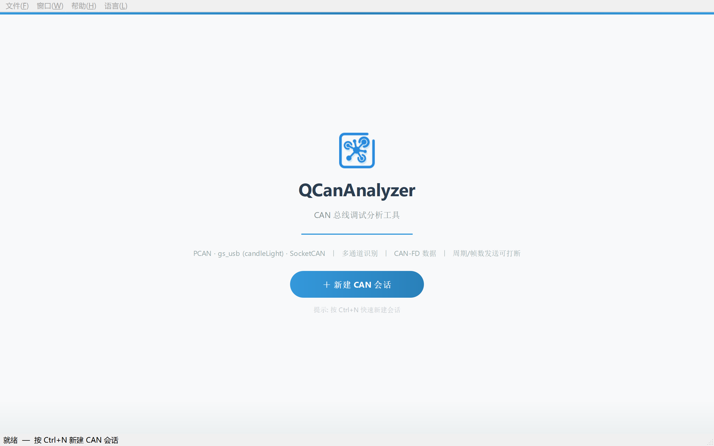
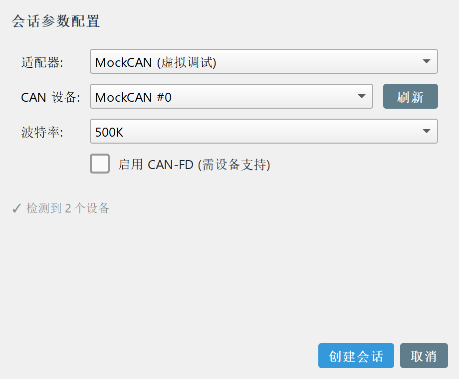
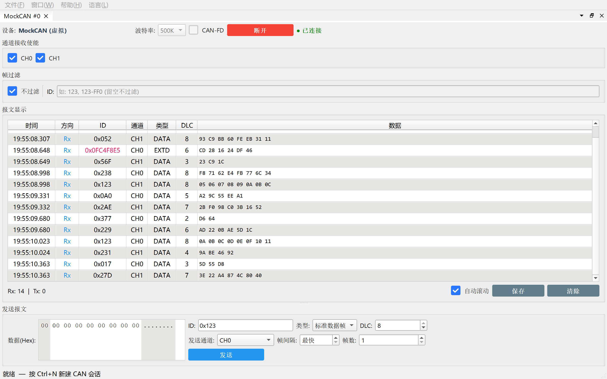
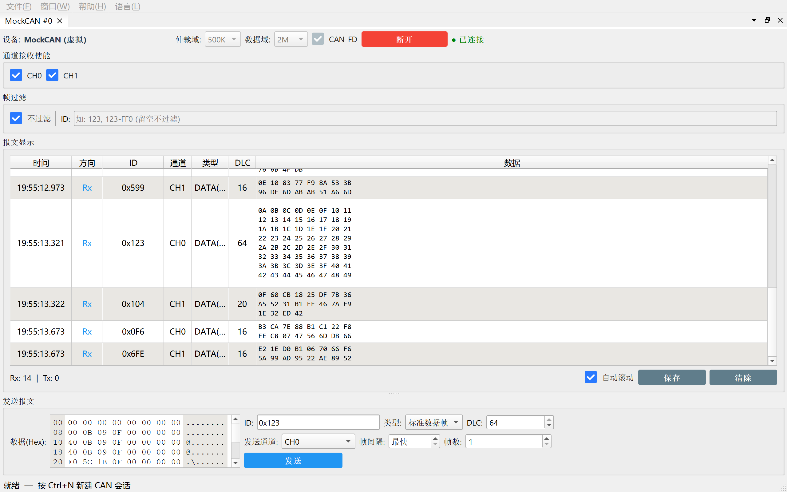
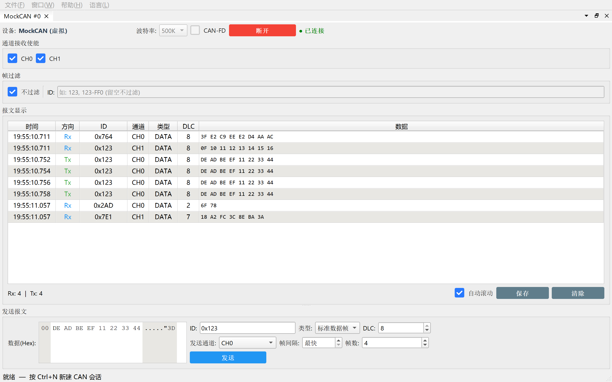

# QCanAnalyzer — CAN / CAN-FD Bus Debugging & Analysis Tool

English | [简体中文](README.zh-CN.md)

[](https://github.com/greyskysoul/QCanAnalyzer/releases)
[](https://github.com/greyskysoul/QCanAnalyzer/releases)
[](https://github.com/greyskysoul/QCanAnalyzer/actions/workflows/build.yml)
[](https://github.com/greyskysoul/QCanAnalyzer)
[](https://github.com/greyskysoul/QCanAnalyzer)
[](https://www.qt.io)
[](LICENSE)

> A cross-platform CAN / CAN-FD bus debugging and analysis tool built on Qt + qt-advanced-docking-system.
> Supports **PCAN, gs_usb (candleLight), ZCANFD (ZLG USBCANFD), ZCAN (ZLG USBCAN), SocketCAN, and MockCAN**.
> Windows / Linux only (MinGW or GCC); without hardware, use the MockCAN adapter available in Debug builds.

> ⚠️ **AI Disclosure**: This project is 100% generated by GitHub Copilot (DeepSeek V4.1 Flash) in VS Code, including but not limited to: project structure design, the multi-adapter architecture, Qt Advanced Docking System integration, all UI layouts and styles, and CAN message TX/RX logic. Humans only provided requirements and verified compilation.

---

## Download

| Platform | File | Notes |
| ---- | ---- | ---- |
| Windows x64 | `QCanAnalyzer-windows-x64.zip` | Portable, unzip and run `QCanAnalyzer.exe` |
| Linux x86_64 | `QCanAnalyzer-*.AppImage` | `chmod +x` and run |

Get the latest **v1.1.0** from [**Releases**](https://github.com/greyskysoul/QCanAnalyzer/releases/latest); see [all releases](https://github.com/greyskysoul/QCanAnalyzer/releases) for older versions.

## Highlights (v1.1.0)

- 📡 **CAN-FD data-phase baud rate actually takes effect** — `CanInterface::open()` gained a data-phase parameter that is now properly passed when creating a session; arbitration and data phase can be configured independently
- 🔢 **Unified CAN-FD DLC semantics** — `CanMessage::dlc` is now the payload byte count throughout, fixing long-frame display
- 🧹 **Cleaned up compiler warnings and dead code**, trimmed comments
- 📸 **Docs updated** — all screenshots regenerated with the Debug-build **MockCAN** adapter, reproducible without hardware

## Table of Contents

- [Download](#download)
- [Highlights (v1.1.0)](#highlights-v110)
- [Features](#features)
- [Supported Devices](#supported-devices)
- [Screenshots](#screenshots)
- [Quick Start](#quick-start)
- [Building](#building)
- [Project Structure](#project-structure)
- [Adding Another CAN Device](#adding-another-can-device)
- [License](#license)

## Features

- 🔌 **Multi-device support** — PCAN (PEAK USB/PCI), gs_usb (candleLight), ZCANFD/ZCAN (ZLG USBCANFD), SocketCAN (Linux), MockCAN (virtual)
- 🐧 **Cross-platform** — Windows + Linux, with native SocketCAN on Linux; unavailable adapters are hidden automatically
- 🪟 **Multi-session docking** — built on Qt Advanced Docking System: run multiple CAN sessions at once with tab groups and freely draggable layouts
- 📡 **CAN-FD support** — DLC 0–64, the data input accepts 64 bytes of hex; arbitration and data-phase baud rates are configured separately
- 📥 **Flexible transmission** — standard/extended/remote frames; periodic sending (period locked to prevent accidental edits); batched sending of a specified frame count; interruptible at any time
- 🔢 **Hex input** — data input filters out invalid characters, keeping only 0-9, A-F, and spaces
- 🔍 **Soft filters** — ID mask filtering plus per-channel enable checkboxes to focus on the traffic you care about
- 📊 **Channel identification** — the message table shows a channel column so multi-channel devices can distinguish sources
- 💾 **CSV export** — save all TX/RX frames (including channel info) to CSV in one click
- 🔗 **Disconnect detection** — connection is monitored every 500 ms; gs_usb supports automatic channel recovery; ZCANFD guards against double-open
- 🌍 **Multilingual** — built-in Simplified Chinese / English translation system
- 🎨 **High-DPI aware** — renders correctly at 175% scaling
- 🧪 **MockCAN virtual adapter** — automatically available in Debug builds for testing and demos without hardware

## Supported Devices

| Adapter       | Platform        | Notes                                             |
| ------------- | --------------- | ------------------------------------------------- |
| **PCAN**      | Windows         | Full PEAK-System lineup, requires PCANBasic.dll   |
| **gs_usb**    | Windows / Linux | Open-source CAN adapters such as candleLight      |
| **ZCANFD**    | Windows / Linux | ZLG USBCANFD series (CAN FD), needs ControlCANFD.dll |
| **ZCAN**      | Windows         | ZLG USBCAN series (classic CAN only), needs ControlCAN.dll |
| **SocketCAN** | Linux           | Kernel-native CAN subsystem (can0, vcan0, ...)    |
| **MockCAN**   | Cross-platform  | Virtual adapter, Debug builds only, for hardware-free testing |

### SocketCAN Notes on Linux

SocketCAN **does not support setting the baud rate in software**; configure it with `ip` before connecting:

```bash
sudo ip link set can0 type can bitrate 500000
sudo ip link set up can0
# Virtual CAN for testing:
sudo modprobe vcan
sudo ip link add dev vcan0 type vcan
sudo ip link set up vcan0
```

## Screenshots

| Welcome page | New session |
| ------ | -------- |
|  |  |

| CAN session (MockCAN) | CAN-FD session |
| ------------------ | ----------- |
|  |  |



> All screenshots were generated with the Debug-build **MockCAN** virtual adapter and can be reproduced without hardware.

## Quick Start

1. Download the package for your platform from [Download](#download) or [Releases](https://github.com/greyskysoul/QCanAnalyzer/releases/latest) and extract it
2. Run `QCanAnalyzer` (Linux) or `QCanAnalyzer.exe` (Windows)
3. On the welcome page click **New Session**, choose device / channel / baud rate, and start sending and receiving
4. Without hardware, use the **MockCAN** virtual adapter in Debug builds

## Building

See [BUILD.md](BUILD.md) for detailed steps; the short version:

### Requirements

- **Qt 5.15+** (MinGW 64-bit / GCC recommended)
- **Windows** or **Linux**
- Git + Git LFS

### Steps

```bash
# 1. Clone the dependency libraries (libs/ is not tracked, you must prepare it manually)
mkdir -p libs && cd libs
git clone --depth 1 --branch 4.5.0 https://github.com/githubuser0xFFFF/Qt-Advanced-Docking-System.git
git clone --depth 1 https://github.com/Simsys/qhexedit2.git
# China mirror: git clone https://gitee.com/czyt1988/Qt-Advanced-Docking-System.git
cd ..
```

```bash
# 2. Pull LFS assets and add the missing ADS version header (required for qmake builds)
git lfs pull
cp ci/ads_version.h libs/Qt-Advanced-Docking-System/src/ads_version.h
```

**All device DLLs / .a files are stored in `third_party/` via Git LFS**; after cloning, make sure LFS files are pulled:

```bash
git lfs pull
```

**Windows — PCAN devices**:

```bash
# PCANBasic.dll is stored in third_party/pcan/ via Git LFS
# You still need the PEAK driver: https://www.peak-system.com
```

**Windows — gs_usb devices**:

```bash
# gs_usb (candleLight) uses the candle API linked statically, no external DLL needed
# Install the WinUSB driver (e.g. with Zadig: https://zadig.akeo.ie/)
```

**Windows — ZCANFD / ZCAN devices**:

```bash
# ControlCANFD.dll / ControlCAN.dll are stored in third_party/zcanfd/ and third_party/zcan/ via Git LFS
# Install the ZLG USBCAN driver (ships with the device)
```

**Linux — ZCANFD devices**:

```bash
# libcontrolcanfd.a is stored in third_party/zcanfd/ via Git LFS
# Statically linked, no extra runtime dependencies
```

**Linux**:

```bash
# On Linux, gs_usb and SocketCAN both go through kernel drivers, no extra DLLs needed
# Make sure the kernel modules are loaded:
sudo modprobe gs_usb        # candleLight devices
sudo modprobe can; sudo modprobe can_raw  # SocketCAN
```

```bash
# 3. Build (see BUILD.md for details)
mkdir -p build && cd build
qmake "CONFIG+=release" ../QCanAnalyzer.pro
make -j$(nproc)   # Linux
mingw32-make -j   # Windows MinGW
```

> You can also use the repository's GitHub Actions workflow to build in the cloud (see [.github/workflows/build.yml](.github/workflows/build.yml)).

## Project Structure

```plaintext
QCanAnalyzer/
├── QCanAnalyzer.pro           # Qt project
├── main.cpp                   # Entry point (high DPI + Fusion style + icon)
├── mainwindow.h/.cpp/.ui      # Main window (StackedWidget: welcome page ↔ dock area)
├── resources.qrc              # Qt resource file
├── icon.png / icon.ico        # Application icons
├── can/
│   ├── canmessage.h           # CanMessage data structure (CAN-FD, 64 bytes)
│   ├── caninterface.h         # CanInterface abstract base class + baud rate helpers
│   ├── canmanager.h/.cpp      # Multi-session manager (tab group management)
│   ├── pcanadapter.h/.cpp     # PCAN adapter (dynamically loads PCANBasic.dll)
│   ├── gsusbadapter.h/.cpp    # gs_usb adapter (candleLight, automatic bittiming search)
│   ├── zcanfdadapter.h/.cpp   # ZCANFD adapter (ZLG USBCANFD, CAN FD)
│   ├── zcanadapter.h/.cpp     # ZCAN adapter (ZLG USBCAN, classic CAN only)
│   ├── socketcanadapter.h/.cpp # SocketCAN adapter (Linux, QSocketNotifier)
│   ├── mockcanadapter.h/.cpp  # MockCAN virtual adapter (Debug builds only, random frame simulation)
├── third_party/
│   ├── CandleApiDriver/       # candle API (compiled into the executable)
│   ├── pcan/PCANBasic.dll     # PCAN Basic API (Git LFS)
│   ├── zcanfd/                # ZCANFD SDK (Git LFS)
│   └── zcan/                  # ZCAN (VCI) SDK (Git LFS)
├── ui/
│   ├── welcomewidget.h/.cpp/.ui        # Welcome page
│   ├── sessionconfigdialog.h/.cpp/.ui   # New session dialog (device/channel/baud/CAN-FD)
│   └── cansessionwidget.h/.cpp/.ui     # CAN session panel (TX/RX/table/soft filters/CSV export)
├── pic/                       # Screenshots
└── libs/
    ├── Qt-Advanced-Docking-System/  # Docking framework (clone it yourself)
    └── qhexedit2/                   # Hex editor (clone it yourself)
```

## Adding Another CAN Device

Subclass `CanInterface` and implement the pure virtual functions to add a new device:

```cpp
class MyAdapter : public CanInterface {
    Q_OBJECT
public:
    QList<CanDeviceInfo> scanDevices() override;
    bool open(int channel, CanBaudRate baud,
              CanDataBaudRate dataBaud = CanDataBaudRate::None) override;
    void close() override;
    bool isOpen() const override;
    bool sendMessage(const CanMessage &msg) override;
    QString adapterName() const override { return "MyDevice"; }
};
```

Then register the adapter in `CanSessionWidget`. A complete integration touches **6 places** (new adapter files, the `CanAdapterType` enum, the `.pro` source list, the `SessionConfigDialog` combo box and scan branch, the `CanSessionWidget` member and `connectDevice()` branch, and the `CanManager` tab title branch); see [AGENTS.md](AGENTS.md) for the checklist.

## License

[MIT](LICENSE)
